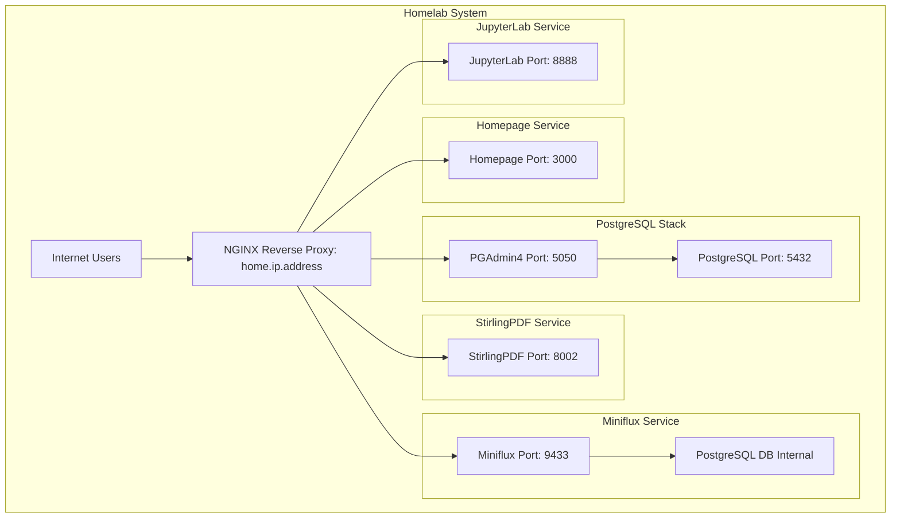

# Home Lab

This project is a complete overview of my home lab.

What is a home lab? As the name suggests, a [home lab](https://linuxhandbook.com/homelab/) is essentially the name given to a server that's set up in your home. People often use this to host applications, servers and docker containers.

## Table of Contents

1. [Introduction](#introduction)
2. [Setup](#setup)
3. [Configuration](#configuration)

## Introduction

Ever since I found out about Linux and what *Open Sourcing* is, I've falled deep down a rabbit hole. Amongst the many intricacies of having a computer is being able to self host services for your own personal needs. For instance, in my particular use case, I use PSQL a lot (mainly because its my favourite SQL language but anyways), so I thought to myself "could I not just host this on a machine and make it run 24/7?"; and that's exactly what I did. 

## Setup

The specs of the machine that I am running isn't anything too fancy, I actually picked this up on facebook marketplace, and just added an SSD inside. 

| Component     | Details                              |
|---------------|--------------------------------------|
| **OS**        | Ubuntu 22.04.5 LTS x86_64            |
| **Host**      | HP ProDesk 400 G1 SFF                |
| **Kernel**    | 6.8.0-57-generic                     |
| **CPU**       | Intel i5-4460 (4 cores) @ 3.40GHz    |
| **GPU 1**     | Intel HD Graphics                    |
| **GPU 2**     | NVIDIA Quadro 600                    |
| **Memory**    | 15.6 GiB RAM                         |
| **Storage**   | 128GB SSD (need to add the hard drive too, but this is okay for the *current* use case) |

