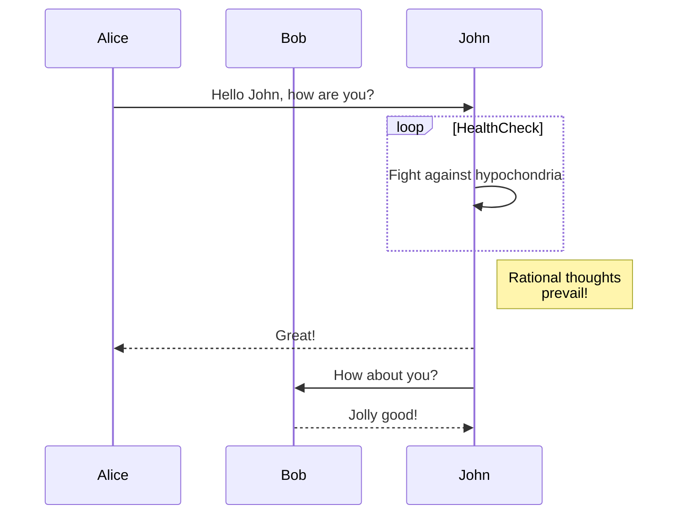

# Home Lab

This project is a complete overview of my home lab.

What is a home lab? As the name suggests, a [home lab](https://linuxhandbook.com/homelab/) is essentially the name given to a server that's set up in your home. People often use this to host applications, servers and docker containers.

## Table of Contents

1. [Introduction](#introduction)
2. [Setup](#setup)
3. [Configuration](#configuration)

## Introduction

## Setup

